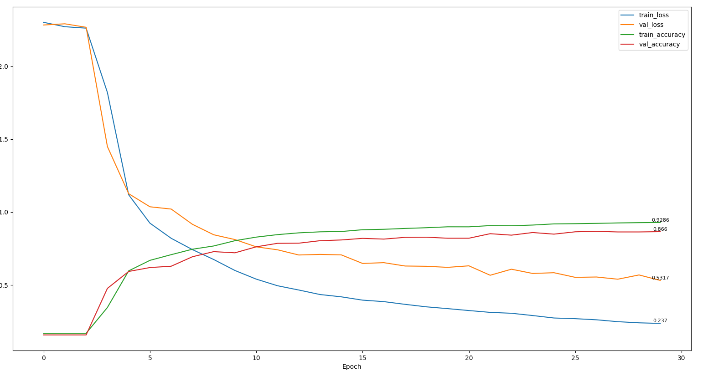

# 数据集USPS
## 训练轮次Epoch
### Epoch=10

### Epoch=20

### Epoch=30

### Epoch=40

### Epoch=100

### Epoch=200

## 卷积层滤波器数量(epoch固定为30)
### 6+16

### 6+32

### 6+48

### 16+48

## 卷积核大小（epoch固定30 卷积层滤波器6+16）
### 5x5 , 5x5

### 4x4 , 5x5

### 5x5 , 4x4

## 增加全连接层神经元数量(epoch=30 卷积层滤波器6+16)

